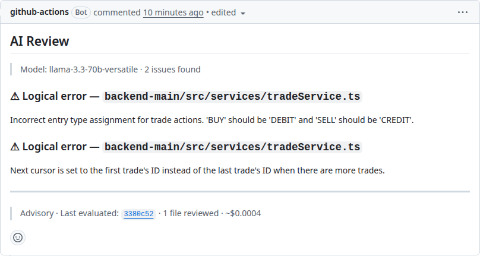

# AI Review

Ripple can call any OpenAI-compatible LLM to review the diff for logical errors, security issues, and missing error handling — and post the findings as a separate comment on the PR. It is fully opt-in and independent of the ownership/impact report.



## 1. Enable in `.ripple.yml`

```yaml
ai-review:
  enabled: true
  api-url: https://api.groq.com/openai   # base URL — /v1/chat/completions appended automatically
  model: llama-3.3-70b-versatile
  focus: logical-errors,error-handling   # comma-separated; see focus values below
  skip-patterns: "**/*.lock,**/*.snap,**/generated/**"
```

## 2. Pass the API key through the workflow

```yaml
- uses: vivek5071/ripple@v1
  with:
    github-token: ${{ secrets.GITHUB_TOKEN }}
    ai-api-key: ${{ secrets.AI_API_KEY }}
```

Add the key as a repository secret: **Settings → Secrets and variables → Actions → New repository secret**.

## Provider table

| Provider | `api-url` | Notes |
|----------|-----------|-------|
| **Groq** (recommended free tier) | `https://api.groq.com/openai` | Free, no credit card. Models: `llama-3.3-70b-versatile`, `mixtral-8x7b-32768`. Get key at console.groq.com. |
| **OpenAI** | `https://api.openai.com` | Models: `gpt-4o`, `gpt-4o-mini`. Supports full structured output. |
| **Azure OpenAI** | `https://<resource>.openai.azure.com/openai/deployments/<deployment>` | Uses Azure RBAC. Set `api-url` to the deployment base URL (no `/v1`). |
| **Ollama** (local) | `http://localhost:11434/openai` | Requires `allow-private-networks: true` in `.ripple.yml`. |
| **vLLM** (private LAN) | `http://192.168.x.x:8000` | Requires `allow-private-networks: true`. |

Ripple negotiates the response format automatically — it tries `json_schema` first (OpenAI structured outputs), then falls back to `json_object`, then plain text. All OpenAI-compatible providers work.

## Focus values

| Value | What it checks |
|-------|----------------|
| `logical-errors` | Incorrect logic, off-by-one errors, wrong conditions |
| `security` | Injection risks, exposed secrets, broken access control |
| `error-handling` | Missing try/catch, silent failures, unhandled promise rejections |
| `broken-assumptions` | Invalid input shape assumptions, broken API contracts |
| `all` | All of the above |

Multiple values: `focus: logical-errors,security,error-handling`

## Additional `.ripple.yml` options

| Key | Default | Description |
|-----|---------|-------------|
| `include-patterns` | `` | Comma-separated globs. When set, only changed files matching at least one pattern are sent to the LLM. Applied before `skip-patterns`. Example: `"src/**,lib/**"` to scope review to source directories only. |
| `skip-patterns` | `` | Comma-separated globs for files to exclude (lock files, snapshots, generated code). |
| `skip-label` | `skip-ai-review` | PR label that disables AI Review for that PR. |
| `budget-usd` | `0` | Max spend per run in USD. Checked before each batch of 5 files; remaining files are listed as skipped-budget in the comment. `0` = unlimited. |
| `min-file-diff-lines` | `1` | Files with fewer changed lines than this are skipped. |
| `min-pr-diff-lines` | `1` | PRs with fewer total changed lines than this skip AI Review entirely. |
| `max-file-tokens` | `32000` | Files whose diff exceeds this token estimate are skipped. |
| `timeout-seconds` | `30` | Per-file LLM call timeout. Timed-out files are noted in the comment. |
| `allow-private-networks` | `false` | Set `true` to allow `api-url` pointing to a private IP (Ollama, vLLM on a LAN). |
| `post-as-comment` | `true` | Set `false` to print findings to the Actions log instead of posting a PR comment. |
| `inline-comments` | `false` | Set `true` to post findings as GitHub inline review comments attached to the diff line. Findings without a line number, or whose line falls outside the diff hunk, fall back to the main comment. Requires `post-as-comment: true`. |

## Example AI Review comment

```
## AI Review

> llama-3.3-70b-versatile · 2 issues found · 1 file reviewed · commit abc1234

### src/services/tradeService.ts

**Line 114 — logical-error**
Incorrect entry type: `BUY` should produce a `DEBIT` (money leaving the account), not `CREDIT`.
Fix: swap the condition — `input.action === 'BUY' ? 'DEBIT' : 'CREDIT'`

**Line 162 — logical-error**
Wrong pagination cursor: `trades[0]!.id` points to the first item in the current page,
not the last. The next page would re-fetch overlapping results.
Fix: use `trades[trades.length - 1]!.id` (or `trades.at(-1)!.id`).
```
