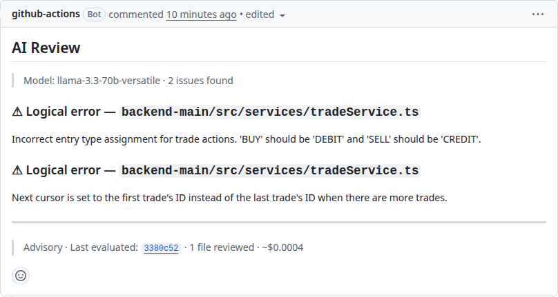

# Experimental AI review

> **Status: Experimental.** AI review is opt-in and disabled by default. Its output depends on the selected model, provider, and context available in the diff. Evaluate it on your repository before relying on its findings. Do not use it as a security check or merge requirement.

Ripple can send a pull request diff to an OpenAI-compatible model and post the findings in a separate comment. The ownership and impact report works without this feature.



## Review scope

AI review receives the changed lines rather than full product requirements or runtime context. It can flag possible problems visible in the diff, including:

- Swapped function arguments
- Off-by-one and incorrect-index errors
- Discarded promise rejections
- Untrusted values interpolated into SQL, shell commands, or HTML

The model has limited context for controls omitted from the diff, such as authorization, tenant isolation, rate limits, quotas, or audit logging. Use [CodeQL](https://codeql.github.com/) or [Semgrep](https://semgrep.dev/) for enforceable security checks. Ripple posts AI findings as advisory comments and does not use them to gate a merge.

## 1. Enable in `.ripple.yml`

```yaml
ai-review:
  enabled: true
  api-url: https://api.groq.com/openai   # base URL — /v1/chat/completions appended automatically
  model: llama-3.3-70b-versatile
  focus: logical-errors,error-handling   # comma-separated; see focus values below
  skip-patterns: "**/*.lock,**/*.snap,**/generated/**"
```

## 2. Pass the API key through the workflow

```yaml
- uses: vivek5071/ripple@v1
  with:
    github-token: ${{ secrets.GITHUB_TOKEN }}
    ai-api-key: ${{ secrets.AI_API_KEY }}
```

Add the key as a repository secret: **Settings → Secrets and variables → Actions → New repository secret**.

## Provider table

| Provider | `api-url` | Notes |
|----------|-----------|-------|
| **Groq** (recommended free tier) | `https://api.groq.com/openai` | Free, no credit card. Models: `llama-3.3-70b-versatile`, `mixtral-8x7b-32768`. Get key at console.groq.com. |
| **OpenAI** | `https://api.openai.com` | Models: `gpt-4o`, `gpt-4o-mini`. Supports full structured output. |
| **Azure OpenAI** | `https://<resource>.openai.azure.com/openai/deployments/<deployment>` | Uses Azure RBAC. Set `api-url` to the deployment base URL (no `/v1`). |
| **Ollama** (local) | `http://localhost:11434/openai` | Requires `allow-private-networks: true` in `.ripple.yml`. |
| **vLLM** (private LAN) | `http://192.168.x.x:8000` | Requires `allow-private-networks: true`. |

Ripple negotiates the response format automatically — it tries `json_schema` first (OpenAI structured outputs), then falls back to `json_object`, then plain text. All OpenAI-compatible providers work.

## Focus values

| Value | What it checks |
|-------|----------------|
| `logical-errors` | Incorrect logic, off-by-one errors, wrong conditions |
| `security` | Injection risks, exposed secrets, broken access control |
| `error-handling` | Missing try/catch, silent failures, unhandled promise rejections |
| `broken-assumptions` | Invalid input shape assumptions, broken API contracts |
| `all` | All of the above |

Multiple values: `focus: logical-errors,security,error-handling`

## Additional `.ripple.yml` options

| Key | Default | Description |
|-----|---------|-------------|
| `include-patterns` | `` | Comma-separated globs. When set, only changed files matching at least one pattern are sent to the LLM. Applied before `skip-patterns`. Example: `"src/**,lib/**"` to scope review to source directories only. |
| `skip-patterns` | `` | Comma-separated globs for files to exclude (lock files, snapshots, generated code). |
| `skip-label` | `skip-ai-review` | PR label that disables AI Review for that PR. |
| `budget-usd` | `0` | Max spend per run in USD. Checked before each batch of 5 files; remaining files are listed as skipped-budget in the comment. `0` = unlimited. |
| `min-file-diff-lines` | `1` | Files with fewer changed lines than this are skipped. |
| `min-pr-diff-lines` | `1` | PRs with fewer total changed lines than this skip AI Review entirely. |
| `max-file-tokens` | `32000` | Files whose diff exceeds this token estimate are skipped. |
| `timeout-seconds` | `30` | Per-file LLM call timeout. Timed-out files are noted in the comment. |
| `allow-private-networks` | `false` | Set `true` to allow `api-url` pointing to a private IP (Ollama, vLLM on a LAN). |
| `post-as-comment` | `true` | Set `false` to print findings to the Actions log instead of posting a PR comment. |
| `inline-comments` | `false` | Set `true` to post findings as GitHub inline review comments attached to the diff line. Findings without a line number, or whose line falls outside the diff hunk, fall back to the main comment. Requires `post-as-comment: true`. |

## Example AI Review comment

```
## AI Review

> Model: llama-3.3-70b-versatile · 2 issues found

### ⚠ Logical error — `src/services/tradeService.ts:114`
Incorrect entry type assignment: BUY should produce a DEBIT, not a CREDIT
**Impact:** Ledger entries are inverted for every buy, so balances drift
**Fix:** Swap the condition — `input.action === 'BUY' ? 'DEBIT' : 'CREDIT'`

### ⚠ Logical error — `src/services/tradeService.ts:162`
Next cursor is set to the first trade's ID instead of the last
**Impact:** The next page re-fetches overlapping results
**Fix:** Use `trades[trades.length - 1].id`

---
> Advisory · Last evaluated: abc1234 · 1 file reviewed · ~$0.0008
```
